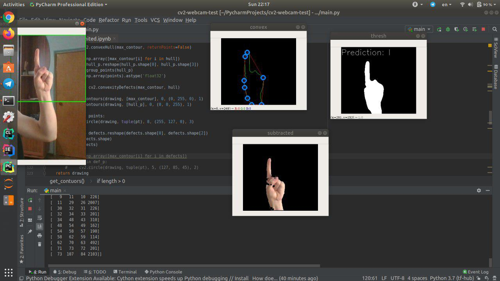
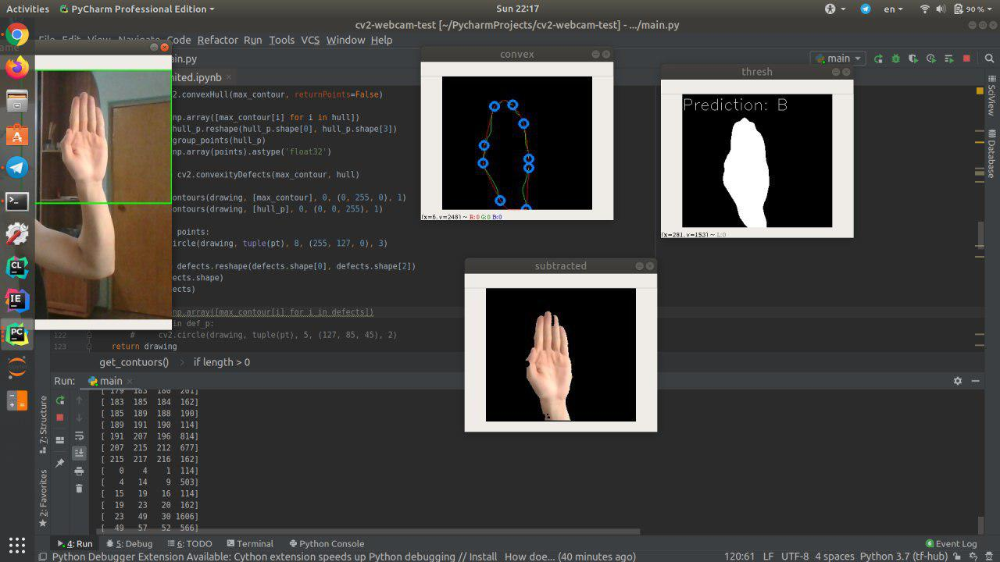

# Real-time sign language recognition

Sign Languages are a set of languages that use predefined actions and movements to convey a message. These languages are primarily developed to aid deaf and other verbally challenged people. They use a simultaneous and precise combination of movement of hands, orientation of hands, hand shapes etc. Different regions have different sign languages like American Sign Language, Russian Sign Language etc. We focus on American Sign language in this project.

## Features

#### Real-time hand detection and preprocessing

неділя, 24. листопада 2019 11:06 

#### Gesture recognition

## Getting Started

### Requirements

  * Python 3.6+
  * macOS or Linux (Windows not officially supported, but might work)

## Support
If you've found an error in this sample, please file an issue:
https://github.com/Sounce/sounce-ML/issues

Changes are encouraged, and may be submitted by forking this project and
submitting a pull request through GitHub. Please see [CONTRIBUTING.md](https://github.com/Sounce/sounce-ML/blob/master/CONTRIBUTING.md) for more details.